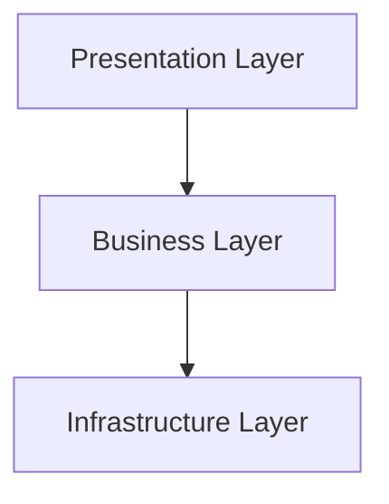
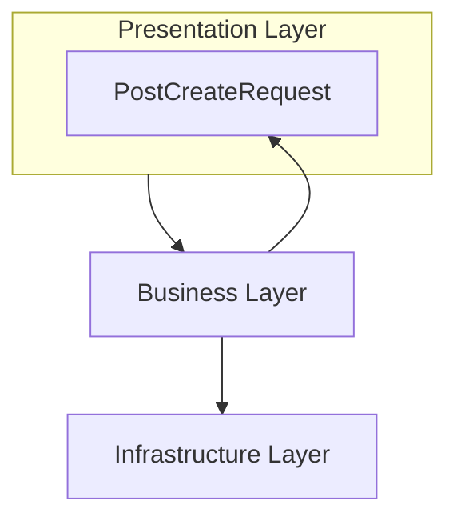
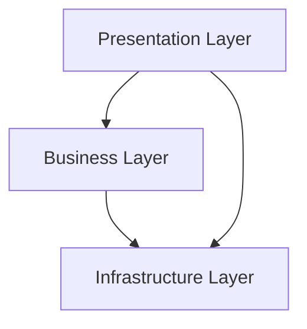

## 6.1. 스마트 UI

**스마트 UI**의 특징:

- **데이터 입출력**: UI가 직접 데이터 수집 및 전송
- **비즈니스 로직 처리**: UI에서 직접 비즈니스 로직 구현
- **데이터베이스 통신**: UI에서 데이터베이스와 상호작용

**문제점**:

- **과도한 책임**: UI가 비즈니스 로직을 포함하여 유지보수성 저하

**올바른 컨트롤러의 역할**:

1. API 호출 방식 정의
2. 비즈니스 로직 실행 정의
3. API 호출 결과 포맷 정의

---

## 6.2. 양방향 레이어드 아키텍처

### 기본 레이어드 아키텍처



- **Presentation Layer**: 사용자 상호작용 처리
- **Business Layer**: 비즈니스 로직 처리
- **Infrastructure Layer**: 외부 시스템과 상호작용

### 양방향 레이어드 아키텍처



**문제점**: 비즈니스 레이어가 프레젠테이션 레이어와 인프라스트럭처 레이어에 의존

### 해결 방안

1. **레이어별 모델 구성**:
    
    ```mermaid
    graph TD
        subgraph A[Presentation Layer]
            B[PostCreateRequest]
        end
    
        subgraph C[Business Layer]
            D[PostCreateCommand]
        end
    
        E[Infrastructure Layer]
    
        A --> C
        B --> D
        C --> E
    ```
    
2. **공통 모델 구성**:
    
    ```mermaid
    graph TD
        A[Presentation Layer]
        B[Business Layer]
        C[Infrastructure Layer]
        subgraph D[Core]
            E[PostCreateRequest]
        end
    
        A --> B
        B --> C
        A --> E
        B --> E
        C --> E
    ```
    

---

## 6.3. 완화된 레이어드 아키텍처



- **문제**: 스마트 UI와 유사하게 레이어 간의 경계가 모호해짐.

---

## 6.4. 트랜잭션 스크립트

- 비즈니스 레이어에서 발생하는 안티패턴.
- 서비스 컴포넌트가 트랜잭션 스크립트처럼 작동하는 경우.

**해결 방안**:

1. 비즈니스 로직은 도메인 모델에서 처리.
2. 서비스는 도메인을 호출하여 작업을 지시.

**올바른 서비스 컴포넌트 동작**:

1. 리포지토리에서 도메인 객체를 불러온다.
2. 도메인 객체에 작업을 시킨다.
3. 리포지토리에 도메인 객체를 저장한다.
4. 컨트롤러에 응답한다.