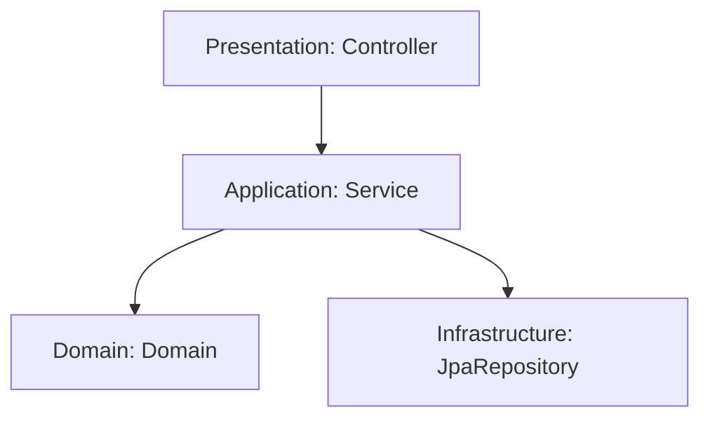

## 8.1. 레이어드 아키텍처 최소 조건

1. **레이어 구조를 사용한다.**
2. **레이어 간의 의존 방향은 단방향으로 유지한다.**
3. **레이어 간 통신은 인접한 레이어에서만 이루어진다.**

## 8.2. 잘못된 레이어드 아키텍처

### 접근 방법 유형

- **유형 1: JPA 엔티티 우선**
    - 인프라스트럭처 레이어를 우선 고려
    - 데이터베이스 테이블 작성을 먼저 진행
    - `JPA`에 의존
- **유형 2: API 엔드포인트 우선**
    - 요청 및 응답 형태를 우선 고려
    - `스프링(스프링 웹 프레임워크)`에 의존

> 결론: 두 접근 모두 기술 스택에 의존적.
> 

## 8.3. 진화하는 아키텍처

- **도메인 레이어**: 순수 자바 코드로, 외부 라이브러리(스프링이나 JPA) 없이 개발 가능.

### 헥사고날 아키텍처

- **포트-어댑터 패턴**: JPA등 강한 결합을 끊고, 인터페이스를 통해 의존성을 관리.
- **장단점 존재**.

## 8.4. 새로운 접근법

- **계정 시스템 개발 시**: 도메인 레이어부터 개발 시작 → 상향식 개발
    - `(Down) Domain` →
        - `ServiceImpl` →
            - `<<interface>> Service` 
            - `<<interface>> Repository` →
                - `Controller` 
                - `RepositoryImpl` → `<<interface>> JpaRepository (Top)`

## 8.5. 빈약한 도메인

- **아키텍처 변경 후 큰 차이를 느끼지 못하는 경우**
    - 요구사항이 단순하여 도메인이 빈약함.
- 단순한 요구 사항에 복잡한 아키텍처를 적용하는 것은 오버 엔지니어링.